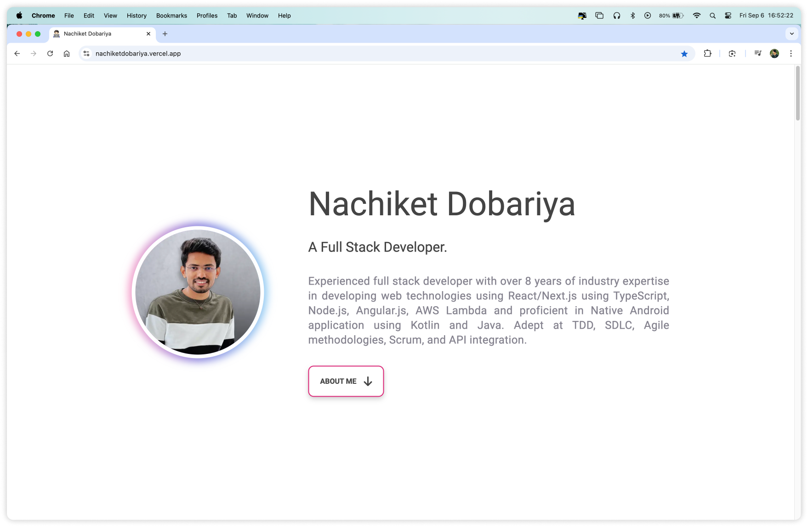
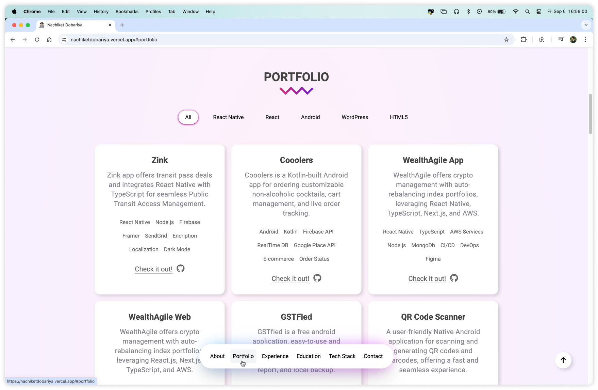
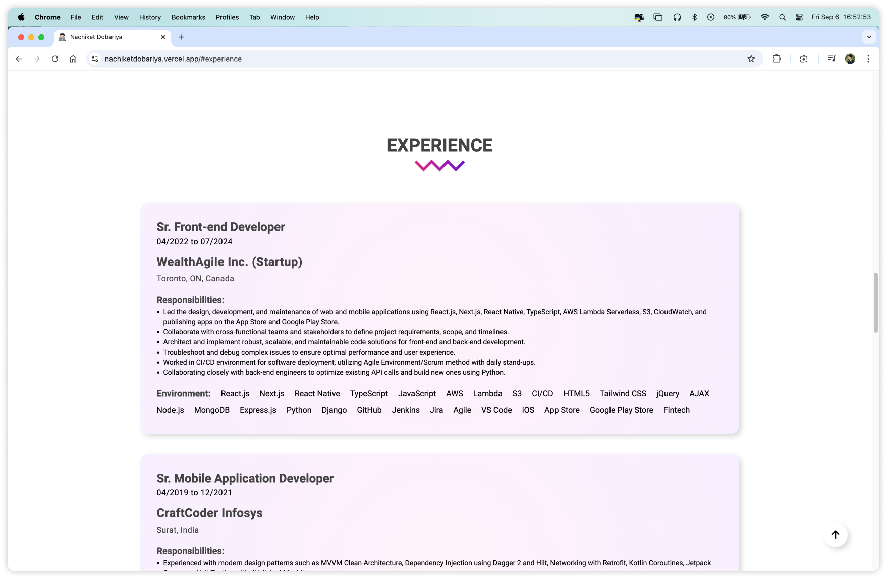
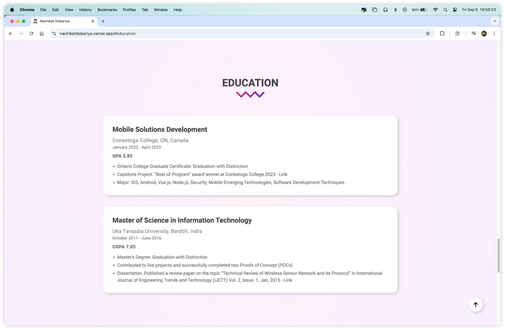
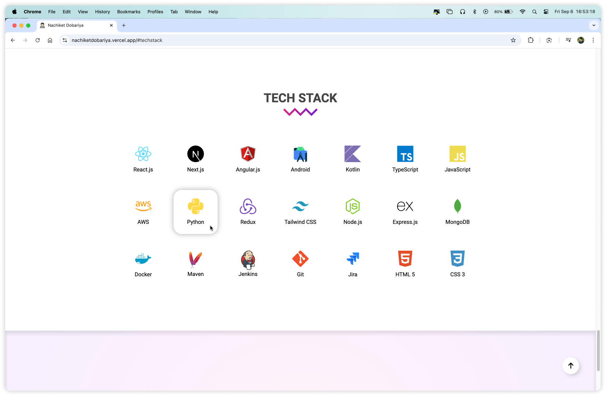
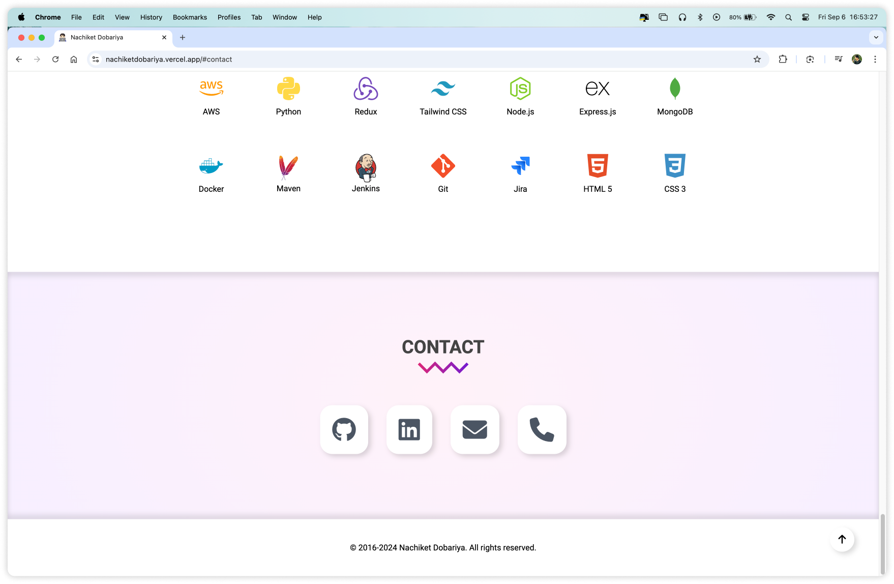
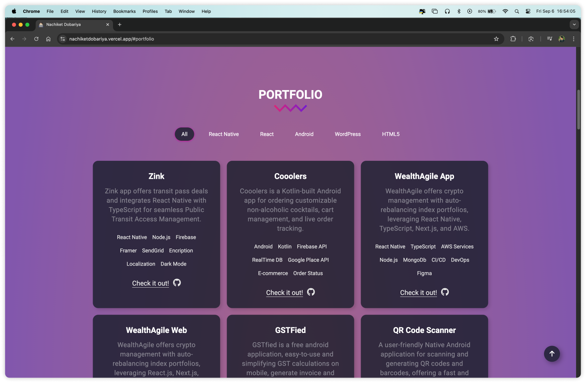
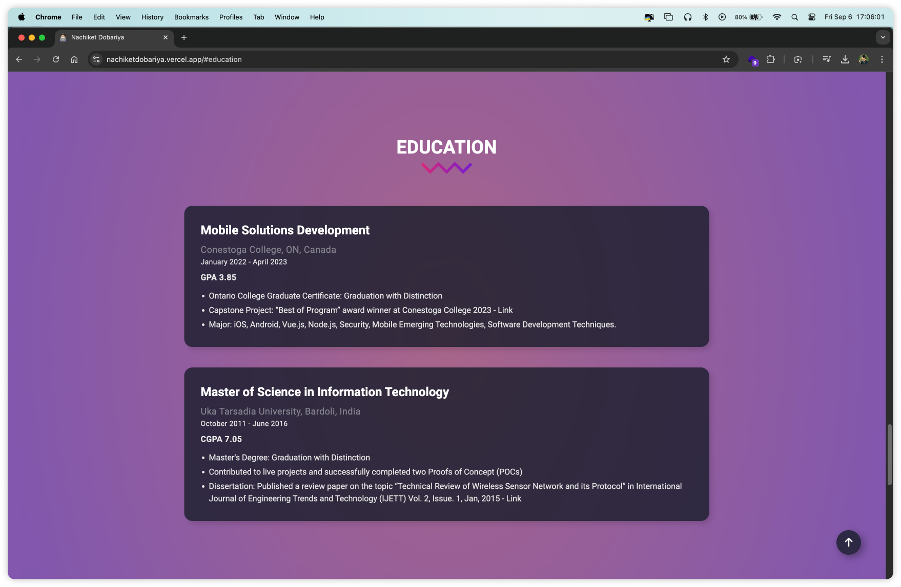
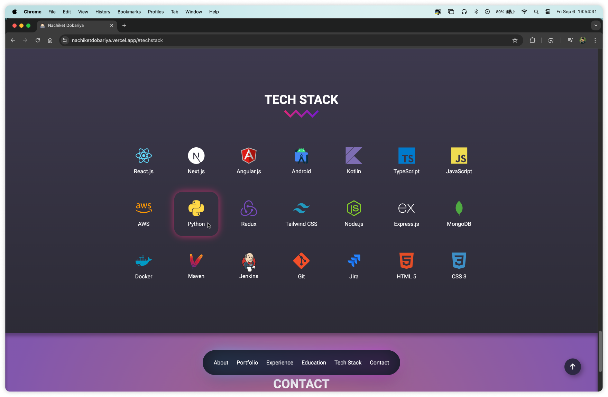
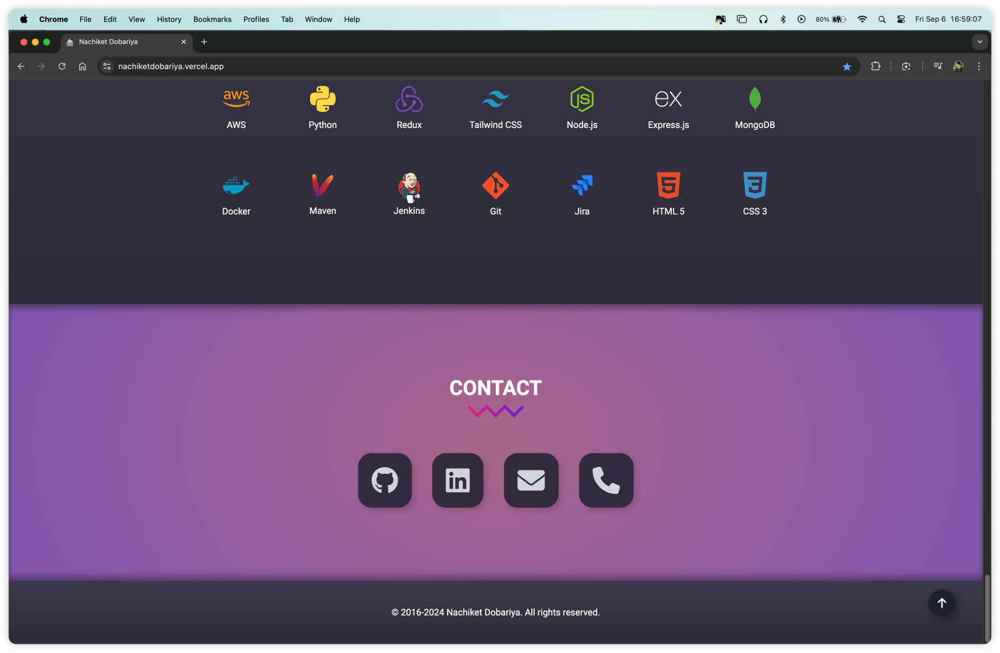

# 🌐 Personal Portfolio Website

This is my personal portfolio website built using the **Next.js** framework. It showcases an overview of my background, a list of my projects, education details, the tech stack I use, and contact links for networking and collaboration.

## ✨ Features
- **👤 Overview:** A brief introduction about me, my experience, and skills.
- **💼 Projects:** A detailed list of my projects with descriptions, technologies used, and links to live demos or repositories.
- **🎓 Education:** My academic background.
- **🛠️ Tech Stack:** Technologies I’m proficient in, including programming languages, frameworks, and tools.
- **📬 Contact:** Links to my LinkedIn, GitHub, email, and phone number for communication.

## 🛠️ Technologies Used

### 🚀 JavaScript Frameworks
- **React**
- **Next.js (v14.2.5)**

### ⚙️ Miscellaneous
- **Webpack (50% sure)**
- **Module Federation (50% sure)**

### 🌍 CDN
- **jsDelivr**

### 📚 JavaScript Libraries
- **AOS (Animate On Scroll)**

### ☁️ PaaS
- **Vercel** (for deployment)

### 🎨 UI Frameworks
- **Tailwind CSS** (for styling)

### ⚡ Performance Optimizations
- Implementing best practices for improved website speed and loading times.

## 🌗 Dark and Light Mode Support
This portfolio website is designed to provide a seamless experience in both dark and light modes. Using **CSS custom properties** and **Tailwind CSS**'s built-in dark mode feature, the website automatically adjusts to your system's color scheme or manual theme preferences. The following features enhance user experience across themes:
- Dynamic background colors and text contrasts.
- Smooth transitions between themes.
- Optimized components for readability and visibility in all modes.

## 🚀 Deployment
The website is deployed using **Vercel**, offering fast and secure hosting for Next.js applications.

## 📲 Contact
Feel free to reach out to me through the following platforms:

      

## 📸 Screenshots

Explore the My Portfolio Website with these preview images:

  
  
  
  
  
  
  
  
  
  

---
